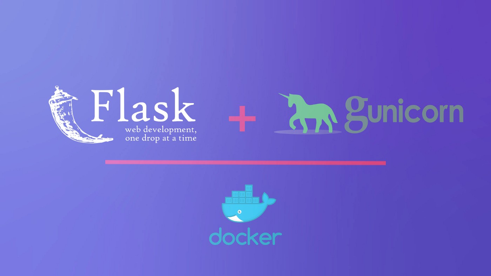

# Flask-skeleton   
Containerized flask web-app, configured to run with `gunicorn`. Also contains examples for `GET` and `POST` requests. 

    

# Building the container:
Requires two build-time arguments: `PORT` and `WORKERS`
> docker build -t car_app:0 --build-arg PORT=80 --build-arg WORKERS=2 .

# Running the container:
> docker run -p `HOST_PORT`:<`PORT`> car_app:0

# Accessing the APIs:
    - GET data   
        - http://<host>:<HOST_PORT>/info
        - http://<host>:<HOST_PORT>/info?type=suv
        - http://<host>:<HOST_PORT>/apiMetadata
    - POST data(add a new entry)
        curl --request POST \
        --url http://<host>:<HOST_PORT>/addInfo \
        --header 'content-type: application/json' \
        --data '{
            "type": "suv",
            "name": "Escalade",
            "make": "Cadillac",
            "price": "90k"
        }'
